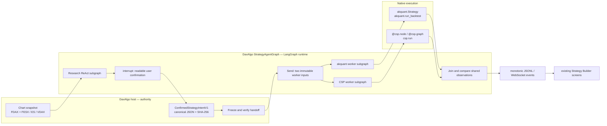
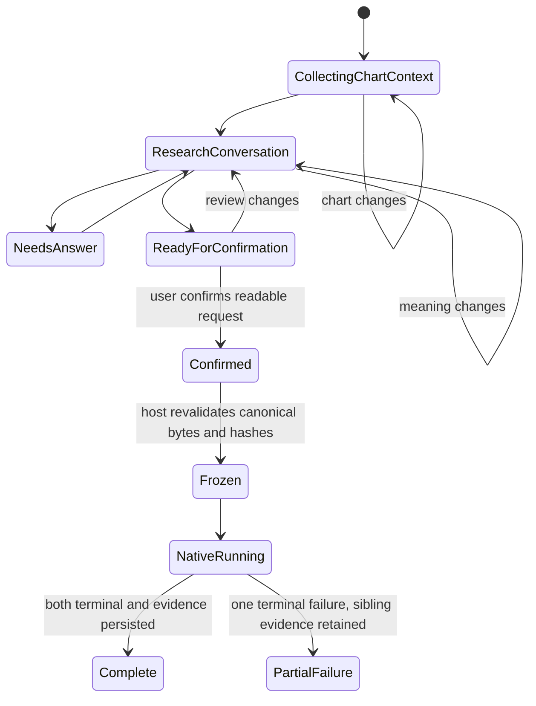

# DaxAlgo Strategy Builder agent architecture

Status: approved direction; native runtime implementation pending
Decision date: 2026-08-08

## Decision

The chart experience, strategy conversation, and native workers form one pipeline with one explicit,
immutable handoff. They are not adjacent features that separately reinterpret the user.

The Python backbone is a narrow DaxAlgo-owned **LangGraph application**. LangGraph supplies the
established state-machine, human-interrupt, checkpoint, parallel-send, join, and streaming
machinery. DaxAlgo supplies only its financial state, tools, validation nodes, and native-engine
adapters. FinanceManus is excluded: it is not imported, forked, copied, or renamed.

The only native execution engines in the first slice are:

- `akquant==0.3.36`: `akquant.Strategy` and `akquant.run_backtest` for orders, fills, trades,
  positions, equity, and P&L;
- `csp==0.18.0`: `@csp.node`, `@csp.graph`, `csp.curve`, and `csp.run` for typed causal event and
  decision-graph execution.

HKUDS/Vibe-Trading and transcend-0/VibeQuant are audited design references, not hidden runtime
coordinators. Vibe-Trading contributes tested ideas for contained workspaces, trace manifests,
memory, tool restriction, and run events. VibeQuant demonstrates a thin, deterministic adapter to
the genuine akquant API. DaxAlgo does not import either product wholesale and does not adopt
VibeQuant's separate `TaskSpec` as a second strategy language.

## The three acceptance tracks

1. **Python architecture:** prove the real LangGraph control flow and genuine akquant/CSP calls
   headlessly.
2. **Contained workflow:** run one complete FDAX situation from frozen chart evidence through
   confirmation, both native workers, and exact results or failures.
3. **UX/UI fit:** connect the same run/event API to the existing two-screen Strategy Builder. The UI
   must not implement another coordinator or reinterpret the confirmed conversation.



## Actual Python foundation

The implementation must use the library primitives directly; it must not introduce a home-grown
agent loop or a generic DaxAlgo agent framework.

```python
from langgraph.graph import StateGraph, START, END
from langgraph.prebuilt import create_react_agent
from langgraph.types import Command, Send, interrupt
from langgraph.checkpoint.sqlite.aio import AsyncSqliteSaver
from langgraph.config import get_stream_writer
from langchain_core.tools import tool

import akquant as aq
import csp
```

The graph owns these concrete responsibilities:

- `StateGraph`: explicit research, confirmation, freeze, worker, comparison, and terminal states;
- `create_react_agent`: one research subgraph and two worker-specific subgraphs, each with an
  immutable tool list;
- `interrupt(...)` and `Command(resume=...)`: the durable user-confirmation boundary;
- `Send(...)`: fan-out of the exact frozen bytes to the akquant and CSP workers;
- a two-input join: comparison starts only after both workers reach a terminal success or failure;
- `AsyncSqliteSaver`: durable state keyed by the host `run_id`;
- `astream(..., stream_mode=["updates", "messages", "custom", "tasks"], subgraphs=True)`: the
  event source used by the CLI and later by the UI;
- `get_stream_writer()`: exact file, scenario, native-call, and failure progress from inside nodes.

The C# host remains authoritative for `ResearchCaseV1`, `ConfirmedStrategyIntentV1`, user identity,
approved market data, and downstream permissions. Python does not create another intent DSL.

## One immutable worker handoff

Both workers receive the same canonical input bytes. The handoff contains:

- selected primary instrument, venue, timeframe, visible range, as-of time, and approved series
  handles;
- zero to three comparison instruments with timestamped observations and provenance;
- the exact `ConfirmedStrategyIntentV1` canonical JSON and hash;
- timestamped shared scenarios, simulated input events, and expected observable decisions;
- explicit execution, sizing, lifecycle, and unwind decisions where applicable;
- the assigned native profile (`akquant@0.3.36` or `csp@0.18.0`);
- dependency-lock, chart-snapshot, and scenario-manifest hashes.

The freeze node recomputes every hash before fan-out. A chart, conversation, review, or scenario
change creates a new handoff; it cannot mutate a running or completed experiment. Unresolved or
unsupported material intent prevents launch.



## Strict worker ownership

There is no tool auto-discovery. The host supplies a fixed list to each subgraph.

| Subgraph | Permitted capabilities | Forbidden capabilities |
|---|---|---|
| Research | read frozen chart bars, comparison indexes, approved indicators and research ledger; calculate point-in-time evidence | source editing, native execution, broker, credentials, network widening |
| akquant | read one frozen handoff; write one workspace; syntax/import checks; shared scenarios; call `aq.run_backtest`; read its artifacts | CSP tools, broker, live orders, arbitrary host filesystem, inherited secrets |
| CSP | read the same frozen handoff; write one workspace; graph build; `csp.curve`; shared scenarios; call `csp.run`; read emitted events | akquant tools, broker, live orders, arbitrary host filesystem, inherited secrets |

Generated worker code executes in separate rootless OCI containers or an equivalent OS-level
isolation boundary: read-only base image, one writable run directory, staged inputs only, disabled
network, no provider or broker secrets, and CPU/memory/process/file-descriptor/wall-time limits. A
virtual environment is packaging, not isolation.

## Concrete first situation

The first acceptance fixture uses five-minute FDAX observations with FESX, ES, and VDAX comparison
series. Every observation carries a timestamp and source handle.

- upward trigger: FDAX `>= +0.80%` over the confirmed window;
- downward trigger: FDAX `<= -0.80%`;
- corroboration: at least two fresh comparisons agree—FESX `+/-0.35%`, ES `+/-0.25%`, inverse VDAX
  `-/+2.00%`;
- staleness: a comparison older than five minutes cannot count; fewer than two fresh confirmations
  produces `no_trade`;
- sizing: risk 0.5% of equity, maximum 20% notional, 40% first tranche and 60% continuation tranche;
- order policy: confirmed market/limit choice, one-bar limit timeout, cancel followed by a distinct
  residual order, TIF, and fill-driven residual sizing;
- lifecycle: 0.6% stop, 1.2% target, six-bar time exit, evidence-loss invalidation, final unwind, and
  exit fill before an opposite-direction entry.

The scenario manifest covers upward continuation, unconfirmed movement, stale evidence, unfilled
limit, partial fill, cancel-plus-new-residual order, stop, target, time exit, invalidation, downward
continuation, exit-then-reverse, OCO sibling cancellation, missing data, and final unwind. Native
atomic replace and atomic reverse are reported as unsupported; DaxAlgo must not simulate them and
label the result as akquant.

## Native result truthfulness

The two engines intentionally produce asymmetric evidence.

| Evidence | akquant | CSP |
|---|---:|---:|
| flat/no-trade/long/short/exit decision | yes | yes |
| order intent | yes | yes |
| native order status and fill | yes | no |
| trade ledger, position, equity and P&L | yes | no |
| typed graph ticks and node outputs | no | yes |

Only shared decision and order-intent observations are compared. CSP is reported as a graph run,
never as a portfolio backtest. One worker's failure cannot erase or cosmetically fail the other
worker's evidence.

Every terminal result binds the handoff hash, generated-source hash, dependency-lock hash,
scenario-input hash, native-output hashes, provider/model identity, and worker profile.

## CLI-first proof

```text
daxalgo-strategy start --chart-context chart.json --prompt "..."
daxalgo-strategy reply <run-id> "..."
daxalgo-strategy confirm <run-id>
daxalgo-strategy run <run-id>
daxalgo-strategy events <run-id> --jsonl
```

The CLI must expose the same event stream later consumed by the UI. Each event contains `run_id`, a
monotonic `sequence`, timestamp, agent, stage, type, and payload. It reports created files, syntax or
graph-build results, native API start/end, each scenario outcome, artifacts, exact capability
failures, and cancellation.

## Strategy Builder connection

UI wiring starts only after the headless situation passes. DaxAlgo then supplies structured chart
context—not merely screenshot pixels—and renders the existing run state:

1. **Design & Confirm:** selected chart/context, research conversation, missing questions, and the
   readable canonical request;
2. **Build, Test & Compare:** akquant source/logs/orders/equity/backtest evidence and CSP
   source/graph/ticks separately;
3. reconnect and cancellation through the same monotonic run/event API.

The UI does not prompt two workers independently, scrape a chart, widen tools, or create a second
state machine.

```text
POST /api/v1/strategy-runs
POST /api/v1/strategy-runs/{id}/messages
POST /api/v1/strategy-runs/{id}/confirm
POST /api/v1/strategy-runs/{id}/run
POST /api/v1/strategy-runs/{id}/cancel
GET  /api/v1/strategy-runs/{id}
WS   /api/v1/strategy-runs/{id}/events?after={sequence}
```

## Reference roles

- **LangGraph:** actual agent/control-flow runtime.
- **HKUDS/Vibe-Trading**, pinned audit `46465ac3cd8d0a35208f974704c5e801a1107a13`: reference for
  ReAct behavior, contained workspaces, memory, manifests, traces, cancellation, and strict tool
  lists. Its full product runtime is not imported because it includes broad discovery, product
  prompts, global stores, and unrelated trading/data surfaces.
- **transcend-0/VibeQuant**, pinned audit `1f5442d88ec97b6075ac73a3c4d0b42d1c00a640`: reference for
  deterministic planning and its genuine thin `aq.run_backtest` adapter. Its DSL and unsandboxed
  in-process generated-code execution are not adopted.
- **Microsoft RD-Agent/Qlib:** later hypothesis/experiment iteration and ML/factor research.
- **ai-hedge-fund:** later alpha/portfolio/risk/execution role separation; its immediate-fill model
  is not a replacement for akquant.
- **TradingAgents:** optional later research-role debate; not a backtester or coordinator for this
  slice.

## Acceptance boundary

The slice passes only when:

1. research asks for missing material choices rather than inventing them;
2. the user confirms one readable, canonical request bound to structured chart evidence;
3. the freeze node rejects any changed byte or unresolved material requirement;
4. both workers receive identical handoff and scenario bytes;
5. generated akquant code imports, passes shared scenarios, and completes a real
   `akquant.run_backtest` with native evidence;
6. generated CSP code builds and completes a real `csp.run` over the same observable situations;
7. CSP is never labeled a market backtest and never reports invented fills or P&L;
8. either worker can fail without losing the sibling's files, events, or native results;
9. the CLI names the exact file, stage, and reason for every failure; and
10. only after those checks pass does the existing Strategy Builder consume the event API.

No broker or live-order capability is permitted in this architecture.
